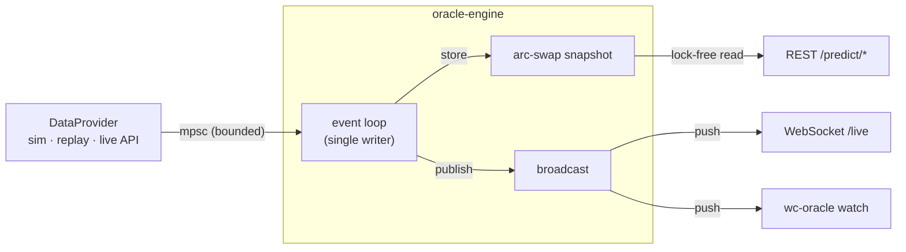

<h1 align="center">⚽ worldcup-oracle</h1>

<p align="center">
  <em>A live, ensemble World Cup prediction engine — in Rust.</em>
</p>

<p align="center">
  <a href="https://github.com/ruhan-sahasi/worldcup-oracle/actions/workflows/ci.yml"></a>
  
  
  
</p>

`worldcup-oracle` ingests live match events — results, goals, red cards, the running
clock — and **continuously re-computes** every team's odds of winning each match and
lifting the trophy. It pairs a genuinely sophisticated statistical model with the
kind of systems engineering a backend role cares about: a modular crate workspace,
a lock-free event-driven core, parallel Monte-Carlo, back-pressured ingestion, a
REST + WebSocket API, and a live terminal dashboard.

It is timed for the **2026 World Cup** and can follow the real tournament via a free
API — but it also ships a deterministic simulator and a replay engine, so it runs
fully offline with **zero keys and zero network**.

---

## ✨ What it does

- **Ensemble predictions** — a Dixon-Coles bivariate-Poisson goal model + Elo ratings,
  blended in log-space, with **Bayesian in-match updating** that shifts the odds as a
  match plays out.
- **Champion odds** — a parallel Monte-Carlo simulator plays the rest of the
  tournament tens of thousands of times to estimate each team's chance of advancing,
  reaching each round, and winning it all.
- **Live, event-driven** — an async engine consumes a stream of match events and
  pushes fresh forecasts to subscribers in real time.
- **Three pluggable data sources** behind one trait — deterministic simulation,
  replay of a finished tournament, or the live [football-data.org](https://www.football-data.org) feed.
- **Multiple surfaces** — a REST API, a WebSocket live stream, and a polished CLI/TUI.

## 🧠 The model (in one breath)

| Piece | What it contributes |
|-------|---------------------|
| **Dixon-Coles** bivariate Poisson, MLE-fit with time decay | full exact-score distribution per matchup |
| **Elo** with home edge + margin-of-victory scaling | a complementary strength signal |
| **Log-opinion-pool ensemble** | a single, sharper blended forecast |
| **Bayesian live updater** | conditions on score + minute + red cards for live odds |
| **Monte-Carlo** (rayon-parallel) | tournament-level champion odds |

Calibration is measured with proper scoring rules (Brier, log-loss) and regression-
tested against a baseline. The maths are written up in [`docs/ARCHITECTURE.md`](docs/ARCHITECTURE.md).

## 🏗️ Architecture

A Cargo workspace of eight crates with strict downhill dependencies from a pure,
zero-I/O domain core:



| Crate | Responsibility |
|-------|----------------|
| `oracle-domain` | pure types (teams, matches, events, probabilities) — no I/O |
| `oracle-ratings` | Elo rating system |
| `oracle-model` | Dixon-Coles, Bayesian live model, ensemble, calibration |
| `oracle-sim` | parallel Monte-Carlo tournament simulator |
| `oracle-ingest` | `DataProvider` trait + sim / replay / live adapters, rate-limit + cache |
| `oracle-engine` | event-driven orchestrator, pub/sub, snapshot cache, metrics |
| `oracle-api` | axum REST + WebSocket server (`oracle-server`) |
| `oracle-cli` | `wc-oracle` — CLI commands + live TUI |

See [`docs/ARCHITECTURE.md`](docs/ARCHITECTURE.md) for diagrams and the model maths.

## 🚀 Quickstart

```bash
# 1. Install Rust (https://rustup.rs) if needed, then:
git clone https://github.com/ruhan-sahasi/worldcup-oracle
cd worldcup-oracle
cargo build --release

# 2. Champion odds for the 2026 World Cup (reproducible with --seed):
cargo run --release -p oracle-cli -- simulate --iters 50000
```

```text
  #  Team                Champ    Final     Semi    Quart      R16
--------------------------------------------------------------------
  1  France              12.4%    19.4%    28.7%    43.1%    67.8%
  2  Argentina            7.6%    12.5%    20.1%    32.8%    53.8%
  3  Spain                6.1%    10.7%    18.3%    32.6%    54.9%
  ...
50000 simulations in 1.01s  (19748 tournaments/sec)
```

```bash
# 3. Predict a single matchup (ensemble + exact-score grid):
cargo run --release -p oracle-cli -- predict --home Brazil --away Argentina
```

```text
  Brazil  vs  Argentina   (neutral venue)

  Ensemble :  Brazil       28.8%    Draw  25.8%    Argentina    45.4%
    Dixon-Coles:   29.2% / 23.7% /  47.1%      Elo:   27.8% / 30.1% /  42.1%

  Expected goals : 1.30 – 1.71
  Most likely    : 1–1  (11.0%)
  Over 2.5 goals : 58.1%      Both teams to score : 59.8%
```

```bash
# 4. Watch a tournament unfold live in your terminal:
cargo run --release -p oracle-cli -- watch          # press q to quit

# 5. Prove the model is calibrated (beats a naive baseline out-of-sample):
cargo run --release -p oracle-cli -- backtest
```

```text
  Model                   Brier   LogLoss      Acc
  ------------------------------------------------
  Uniform baseline       0.6667    1.0986    33.3%
  Dixon-Coles            0.6344    1.0535    45.0%
  Ensemble (+Elo)        0.6366    1.0594    46.2%
```

### Run the server

```bash
cargo run --release -p oracle-cli -- serve         # or: cargo run -p oracle-api --bin oracle-server
# then, in another shell:
curl localhost:8080/predict/tournament | jq '.teams[:5]'
curl localhost:8080/predict/match/1
```

| Method | Path | Description |
|--------|------|-------------|
| `GET` | `/health` | liveness probe |
| `GET` | `/teams` | current Elo ratings |
| `GET` | `/matches` | all match predictions (compact) |
| `GET` | `/predict/match/{id}` | one match: live odds + exact-score grid |
| `GET` | `/predict/tournament` | champion-odds table |
| `GET` | `/metrics` | Prometheus metrics |
| `GET` | `/live` | **WebSocket** — pushes a compact live view on every update |

### Go live (optional)

Drop a free API key in `.env` (`cp .env.example .env`) and the engine switches to the
real 2026 World Cup feed automatically:

```bash
FOOTBALL_DATA_API_KEY=your_key   # from football-data.org
```

No key? It runs the deterministic simulation — every command above works unchanged.

### Docker

```bash
docker compose up --build         # serves on :8080
```

## 🛠️ What this project demonstrates

- **Workspace architecture & dependency inversion** — a pure domain core with a
  trait-based data seam (`DataProvider`) and transport layers as thin shells.
- **Async, event-driven concurrency** — `tokio` mpsc ingestion with back-pressure,
  `broadcast` fan-out pub/sub, **single-writer state with lock-free `arc-swap` reads**,
  graceful cancellation.
- **Data-parallelism** — `rayon`-parallel Monte-Carlo with deterministic per-iteration
  seeding; ~20k full tournament simulations/second.
- **Applied statistics** — Dixon-Coles MLE with time decay, Elo, Bayesian conditioning,
  log-opinion-pool ensembling, and **proper scoring rules** for honest evaluation.
- **Production hygiene** — a hand-rolled token-bucket rate limiter + TTL cache around
  the live API, structured `tracing`, Prometheus metrics, `#![forbid(unsafe_code)]`,
  unit + property + integration tests, Criterion benchmarks, CI, and Docker.

## 🧪 Tests & benchmarks

```bash
cargo test --workspace          # unit + integration (incl. calibration guard)
cargo clippy --workspace --all-targets -- -D warnings
cargo bench -p oracle-sim       # Monte-Carlo throughput
```

## 📌 Scope & honest limitations

- The bundled roster/draw is a **representative sample** for offline use, not FIFA's
  official draw; the live adapter pulls the real teams, fixtures, and results.
- Offline training data is **synthetic but reproducible** (drawn from team-strength
  priors) so the fit and backtest run without a network; supply an API key for real data.
- The knockout simulator uses a standard seeded single-elimination bracket rather than
  FIFA's exact slotting, and re-samples in-progress matches rather than conditioning on
  their live score. Both are documented in the code.

## 📄 License

MIT © Ruhan Sahasi — see [LICENSE](LICENSE).
