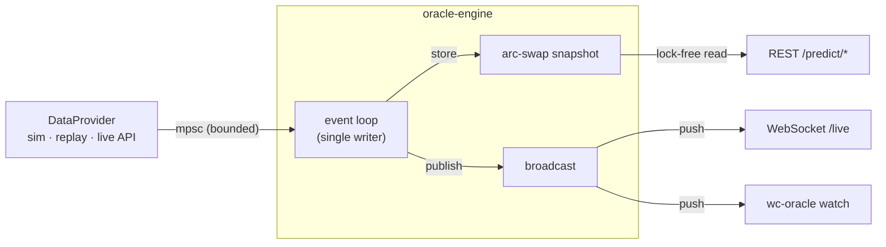

<h1 align="center">⚽ worldcup-oracle</h1>

<p align="center">
  <em>A live, ensemble World Cup prediction engine in Rust.</em>
</p>

<p align="center">
  <a href="https://github.com/ruhan-sahasi/worldcup-oracle/actions/workflows/ci.yml"></a>
  
  
  
</p>

`worldcup-oracle` ingests live match events including results, goals, red cards, the running
clock, and **continuously re-computes** every team's odds of winning each match and
lifting the trophy. It pairs a sophisticated statistical model with the
kind of systems engineering a backend role cares about: a modular crate workspace,
a lock-free event-driven core, parallel Monte-Carlo, back-pressured ingestion, a
REST + WebSocket API, and a live terminal dashboard.

It is timed for the **2026 World Cup** and can follow the real tournament via a free
API, but it also ships a deterministic simulator and a replay engine, so it runs
fully offline with **zero keys and zero network**.

---

## ✨ What it does

- **Ensemble predictions** -> a Dixon-Coles bivariate-Poisson goal model + Elo ratings,
  blended in log-space, with **Bayesian in-match updating** that shifts the odds as a
  match plays out.
- **Champion odds** -> a parallel Monte-Carlo simulator plays the rest of the
  tournament tens of thousands of times to estimate each team's chance of advancing,
  reaching each round, and winning it all.
- **Live, event-driven** -> an async engine consumes a stream of match events and
  pushes fresh forecasts to subscribers in real time.
- **Three pluggable data sources** behind one trait -> deterministic simulation,
  replay of a finished tournament, or the live [football-data.org](https://www.football-data.org) feed.
- **Lineup aware** -> a confirmed starting XI adjusts a team's effective attack and
  defense, so resting or losing a key player visibly moves that team's odds.
- **Multiple surfaces** -> a REST API, a WebSocket live stream, a live web dashboard,
  and a polished CLI/TUI.

## 🧠 The model (in one breath)

| Piece | What it contributes |
|-------|---------------------|
| **Dixon-Coles** bivariate Poisson, MLE-fit with time decay | full exact-score distribution per matchup |
| **Elo** with home edge + margin-of-victory scaling | a complementary strength signal |
| **Log-opinion-pool ensemble** (weights + temperature **learned by stacking**) | a single, sharper blended forecast that's provably ≥ its best member |
| **Bayesian live updater** | conditions on score + minute + red cards for live odds |
| **Lineup adjustment** | a confirmed XI shifts each team's attack and defense |
| **Monte-Carlo** (rayon-parallel, **conditions in-progress matches** on their live score) | tournament-level champion odds that move with live results |

Calibration is measured with proper scoring rules (Brier, log-loss), benchmarked against
the bookmaker's implied odds, and regression-tested. The maths are written up in
[`docs/ARCHITECTURE.md`](docs/ARCHITECTURE.md).

## 🏗️ Architecture

A Cargo workspace of eight crates with strict downhill dependencies from a pure,
zero-I/O domain core:



| Crate | Responsibility |
|-------|----------------|
| `oracle-domain` | pure types (teams, matches, events, probabilities); no I/O |
| `oracle-ratings` | Elo rating system |
| `oracle-model` | Dixon-Coles, Bayesian live model, ensemble, calibration |
| `oracle-sim` | parallel Monte-Carlo tournament simulator |
| `oracle-ingest` | `DataProvider` trait + sim / replay / live adapters, rate-limit + cache |
| `oracle-engine` | event-driven orchestrator, pub/sub, snapshot cache, metrics |
| `oracle-api` | axum REST + WebSocket server (`oracle-server`) |
| `oracle-cli` | `wc-oracle`: CLI commands + live TUI |

See [`docs/ARCHITECTURE.md`](docs/ARCHITECTURE.md) for diagrams and the model maths.

## 🚀 Quickstart

```bash
# 1. Install Rust (https://rustup.rs) if needed, then:
git clone https://github.com/ruhan-sahasi/worldcup-oracle
cd worldcup-oracle
cargo build --release

# 2. Champion odds for the 2026 World Cup (reproducible with --seed):
cargo run --release -p oracle-cli -- simulate --iters 50000
```

```text
  #  Team                Champ    Final     Semi    Quart      R16
--------------------------------------------------------------------
  1  France              12.3%    18.9%    27.9%    42.7%    67.3%
  2  Argentina            7.6%    12.7%    20.3%    33.2%    54.7%
  3  Spain                6.7%    11.7%    19.1%    33.9%    55.9%
  ...
50000 simulations in 1.0s  (~50k tournaments/sec)
```

```bash
# 3. Predict a single matchup (ensemble + exact-score grid):
cargo run --release -p oracle-cli -- predict --home Brazil --away Argentina
```

```text
  Brazil  vs  Argentina   (neutral venue)

  Ensemble :  Brazil       31.8%    Draw  28.0%    Argentina    40.2%
    Dixon-Coles:   32.7% / 23.5% /  43.8%      Elo:   27.8% / 30.1% /  42.1%

  Expected goals : 1.40 – 1.65
  Most likely    : 1–1  (10.8%)
  Over 2.5 goals : 58.7%      Both teams to score : 60.6%
```

```bash
# 4. Watch a tournament unfold live in your terminal:
cargo run --release -p oracle-cli -- watch          # press q to quit

# 5. Backtest and benchmark against the bookmaker (synthetic data, or --data a real CSV):
cargo run --release -p oracle-cli -- backtest
cargo run --release -p oracle-cli -- backtest --data path/to/football-data.csv
```

```text
  Model                   Brier   LogLoss      Acc
  ------------------------------------------------
  Uniform baseline       0.6667    1.0986    33.3%
  Dixon-Coles            0.6277    1.0415    47.6%
  Elo                    0.6719    1.1273    46.4%
  Ensemble (learned)     0.6354    1.0544    47.4%
  Market (bookmaker)     0.6221    1.0339    49.2%

  learned weights: Dixon-Coles 0.65 / Elo 0.35   temperature 0.70
```

Stacking learns the member weights and a temperature on a held-out split, so the
ensemble is provably no worse than its best member. The bookmaker's implied odds are the
hard bar to beat: the engine approaches the market but does not (yet) clear it.
`--data` runs the same three-way split on a real
[football-data.co.uk](https://www.football-data.co.uk) results CSV with closing odds.

### Run the server and live dashboard

```bash
cargo run --release -p oracle-cli -- serve         # or: cargo run -p oracle-api --bin oracle-server
# open the live dashboard:
open http://localhost:8080/
# or hit the API directly:
curl localhost:8080/predict/tournament | jq '.teams[:5]'
curl localhost:8080/predict/match/1
```

Visiting `/` serves a self-contained dashboard (no build step, no CDN) that subscribes to
the `/live` WebSocket and renders live match win bars, a championship-odds leaderboard, a
probability-over-time chart, and a feed-health indicator, all updating in real time.

| Method | Path | Description |
|--------|------|-------------|
| `GET` | `/` | **live web dashboard** |
| `GET` | `/api` | service info + endpoint list (JSON) |
| `GET` | `/health` | liveness probe |
| `GET` | `/teams` | current Elo ratings |
| `GET` | `/matches` | all match predictions (compact) |
| `GET` | `/predict/match/{id}` | one match: live odds + exact-score grid |
| `GET` | `/predict/tournament` | champion-odds table |
| `GET` | `/metrics` | Prometheus metrics |
| `GET` | `/live` | **WebSocket**: pushes a compact live view on every update |

### Go live (optional)

Drop a free API key in `.env` (`cp .env.example .env`) and the engine switches to the
real 2026 World Cup feed automatically:

```bash
FOOTBALL_DATA_API_KEY=your_key   # from football-data.org
```

No key? It runs the deterministic simulation, and every command above works unchanged.

### Docker

```bash
docker compose up --build         # serves on :8080
```

## 🛠️ What this project demonstrates

- **Workspace architecture & dependency inversion** -> a pure domain core with a
  trait-based data seam (`DataProvider`) and transport layers as thin shells.
- **Async, event-driven concurrency** -> `tokio` mpsc ingestion with back-pressure,
  `broadcast` fan-out pub/sub, **single-writer state with lock-free `arc-swap` reads**,
  graceful cancellation.
- **Data-parallelism** -> `rayon`-parallel Monte-Carlo with deterministic per-iteration
  seeding; ~50k full tournament simulations/second.
- **Applied statistics** -> Dixon-Coles MLE with time decay, Elo, Bayesian conditioning,
  lineup-aware attack/defense adjustments, a **stacked** ensemble (weights + temperature
  learned to minimize held-out log-loss), and **proper scoring rules** measured against
  the **bookmaker's implied odds** on real or synthetic data.
- **Resilient ingestion** -> an authoritative `ScoreSync` reconciliation (so a dropped or
  duplicated poll can't corrupt the score), a feed-health signal with exponential
  backoff, a hand-rolled token-bucket rate limiter + TTL cache, structured `tracing`,
  Prometheus metrics, `#![forbid(unsafe_code)]`, unit + property + integration tests,
  Criterion benchmarks, CI, and Docker.
- **Full-stack delivery** -> a dependency-free live web dashboard (vanilla JS + canvas)
  served by the API and driven entirely off the `/live` WebSocket.

## 🧪 Tests & benchmarks

```bash
cargo test --workspace          # unit + integration (incl. calibration guard)
cargo clippy --workspace --all-targets -- -D warnings
cargo bench -p oracle-sim       # Monte-Carlo throughput
```

## 📌 Scope & honest limitations

- The bundled roster/draw is a **representative sample** for offline use, not FIFA's
  official draw; the live adapter pulls the real teams, fixtures, and results.
- Offline training data and the offline "bookmaker" line are **synthetic but
  reproducible** (drawn from team-strength priors), so the fit, backtest, and market
  benchmark run without a network. The synthetic backtest validates the *machinery*; for
  a real skill measurement pass `backtest --data` a real results CSV with closing odds.
- Squads are **synthetic** for offline use, so the lineup feature is fully demonstrable
  via the simulation feed; the live football-data.org adapter does not yet ingest real
  lineups, so it degrades gracefully to no adjustment.
- In-progress **group** matches are conditioned on their live score, but the knockout
  simulator still builds a fresh bracket each run (a standard seeded single-elimination
  template, not FIFA's exact slotting); conditioning live *knockout* matches is future
  work. All documented in the code.

## 📄 License

MIT © Ruhan Sahasi. See [LICENSE](LICENSE).
