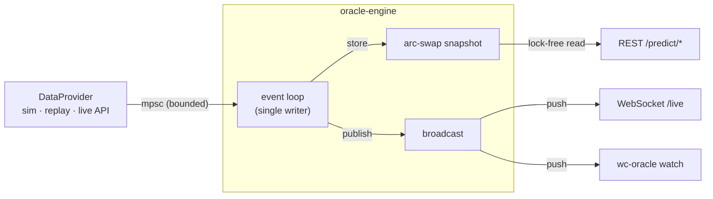

<h1 align="center">⚽ worldcup-oracle</h1>

<p align="center">
  <em>A live, ensemble World Cup prediction engine in Rust.</em>
</p>

<p align="center">
  <a href="https://github.com/ruhan-sahasi/worldcup-oracle/actions/workflows/ci.yml"></a>
  
  
  
</p>

`worldcup-oracle` ingests live match events including results, goals, red cards, the running
clock, and **continuously re-computes** every team's odds of winning each match and
lifting the trophy. It pairs a sophisticated statistical model with the
kind of systems engineering a backend role cares about: a modular crate workspace,
a lock-free event-driven core, parallel Monte-Carlo, back-pressured ingestion, a
REST + WebSocket API, and a live terminal dashboard.

It is timed for the **2026 World Cup** and can follow the real tournament via a free
API, but it also ships a deterministic simulator and a replay engine, so it runs
fully offline with **zero keys and zero network**.

---

## ✨ What it does

- **Ensemble predictions** -> a Dixon-Coles bivariate-Poisson goal model + Elo ratings,
  blended in log-space, with **Bayesian in-match updating** that shifts the odds as a
  match plays out.
- **Champion odds** -> a parallel Monte-Carlo simulator plays the rest of the
  tournament tens of thousands of times to estimate each team's chance of advancing,
  reaching each round, and winning it all.
- **Live, event-driven** -> an async engine consumes a stream of match events and
  pushes fresh forecasts to subscribers in real time.
- **Three pluggable data sources** behind one trait -> deterministic simulation,
  replay of a finished tournament, or the live [football-data.org](https://www.football-data.org) feed.
- **Lineup aware** -> a confirmed starting XI adjusts a team's effective attack and
  defense, so resting or losing a key player visibly moves that team's odds.
- **Multiple surfaces** -> a REST API, a WebSocket live stream, a live web dashboard,
  and a polished CLI/TUI.

## 🧠 The model (in one breath)

| Piece | What it contributes |
|-------|---------------------|
| **Dixon-Coles / bivariate-Poisson** goal model, MLE-fit (convergence-checked) with time decay + ridge, **fit on xG when available**, **updated online from results**, **negative-binomial (overdispersed) margins**, and **hierarchical confederation pooling** | full exact-score distribution that sharpens as the tournament unfolds, with the fatter blowout/goalless tails real football shows; sparse teams borrow strength from their confederation; the score model and fit hyperparameters are **tuned by held-out log-loss** |
| **Elo** with home edge + margin-of-victory scaling | a complementary strength signal |
| **State-space (Kalman) rating** - each team a Gaussian `N(mean, var)`, random-walk between matches + Kalman update from each result | principled in-tournament learning *and* a per-team uncertainty that the Monte-Carlo consumes |
| **Log-opinion-pool ensemble** (`[Dixon-Coles, Elo, State-space, Market]` weights + temperature **learned by out-of-fold stacking**) | a single sharper forecast, anchored to the bookmaker when odds are present; weights trained on leakage-free predictions over the whole dataset |
| **Bayesian live updater** with **score effects** | conditions on score, minute, and red cards; a trailing team chases and a leading team defends |
| **Lineup adjustment** | a confirmed XI shifts each team's attack and defense |
| **Suspension tracking** | yellow-card accumulation drops a suspended starter from the next match before its lineup is known |
| **Venue, crowd, travel & heat context** | host advantage, altitude, rest-day differential, a continuous **crowd-partisanship** signal (diaspora / traveling fans, not just literal hosts), **continental travel + time-zone load** (eastward trips bite harder), and **match-time heat** (afternoon kickoffs in Dallas/Monterrey/Miami suppress tempo, which also flattens the favourite's edge) adjust each match |
| **Style matchup** (a low-rank style embedding per team, scored by a **bilinear** `sₕᵀ M sₐ` form) | a **non-transitive** rock-paper-scissors edge that additive ratings cannot represent (style A troubles style B) |
| **Knockout factors** (per-team **penalty-shootout skill** + **knockout pedigree**) | knockout-only signals open-play strength can't capture: who wins shootouts, and who handles single-elimination pressure (debutant-heavy in a 48-team field) |
| **Monte-Carlo** (rayon-parallel, **conditions in-progress matches** on their live score; the **fixed 2026 knockout bracket**; knockouts go to **extra time + a near-50/50 shootout**; **resamples team strength each iteration**) | tournament-level champion odds that move with live results and carry parameter uncertainty |

Calibration is measured with proper scoring rules (Brier, log-loss), benchmarked against
the bookmaker's implied odds, and regression-tested. The maths are written up in
[`docs/ARCHITECTURE.md`](docs/ARCHITECTURE.md).

## 🏗️ Architecture

A Cargo workspace of eight crates with strict downhill dependencies from a pure,
zero-I/O domain core:



| Crate | Responsibility |
|-------|----------------|
| `oracle-domain` | pure types (teams, matches, events, probabilities); no I/O |
| `oracle-ratings` | Elo + state-space (Kalman) rating systems |
| `oracle-model` | Dixon-Coles, Bayesian live model, ensemble, calibration |
| `oracle-sim` | parallel Monte-Carlo tournament simulator |
| `oracle-ingest` | `DataProvider` trait + sim / replay / live adapters, rate-limit + cache |
| `oracle-engine` | event-driven orchestrator, pub/sub, snapshot cache, metrics |
| `oracle-api` | axum REST + WebSocket server (`oracle-server`) |
| `oracle-cli` | `wc-oracle`: CLI commands + live TUI |

See [`docs/ARCHITECTURE.md`](docs/ARCHITECTURE.md) for diagrams and the model maths.

## 🚀 Quickstart

```bash
# 1. Install Rust (https://rustup.rs) if needed, then:
git clone https://github.com/ruhan-sahasi/worldcup-oracle
cd worldcup-oracle
cargo build --release

# 2. Champion odds for the 2026 World Cup (reproducible with --seed):
cargo run --release -p oracle-cli -- simulate --iters 50000
```

```text
  #  Team             Champ (±MC err)    Final     Semi    Quart      R16
--------------------------------------------------------------------------
  1  France              8.7% ± 0.2%    14.2%    22.8%    36.5%    57.9%
  2  Argentina           7.5% ± 0.2%    12.2%    20.2%    32.5%    53.6%
  3  Spain               6.7% ± 0.2%    11.3%    18.8%    31.7%    52.4%
  ...
(host advantage, altitude, and rest folded in; ±MC err is the Monte-Carlo standard error)
```

```bash
# 3. Predict a matchup. Pass --*-odds to anchor the ensemble to a bookmaker line;
#    pass --posterior for HMC 90% credible intervals (the model's uncertainty about itself):
cargo run --release -p oracle-cli -- predict --home Brazil --away Argentina \
    --home-odds 2.4 --draw-odds 3.2 --away-odds 2.9
cargo run --release -p oracle-cli -- predict --home Brazil --away Argentina --posterior
```

```text
  Brazil  vs  Argentina   (neutral venue)

  Ensemble :  Brazil       35.2%    Draw  28.1%    Argentina    36.7%
    Dixon-Coles:   34.0% / 25.6% /  40.3%      Elo:   27.8% / 30.1% /  42.1%
    Market     :   38.8% / 29.1% /  32.1%   (vig removed; anchored into the ensemble)

  Expected goals : 1.34 – 1.48
  Most likely    : 1–1
```

```bash
# 4. Watch a tournament unfold live in your terminal:
cargo run --release -p oracle-cli -- watch          # press q to quit

# 5. Backtest and benchmark against the bookmaker (synthetic data, or --data a real CSV):
cargo run --release -p oracle-cli -- backtest
cargo run --release -p oracle-cli -- backtest --data path/to/football-data.csv
cargo run --release -p oracle-cli -- backtest --cv 5   # rolling-origin CV with 95% CIs
```

```text
  Model                   Brier   LogLoss      Acc
  ------------------------------------------------
  Uniform baseline       0.6667    1.0986    33.3%
  Dixon-Coles (goals)    0.6168    1.0284    50.1%
  Dixon-Coles (xG)       0.6097    1.0182    50.7%
  Elo                    0.6515    1.1080    48.1%
  Ensemble (+Market)     0.6170    1.0286    49.5%
  Market (bookmaker)     0.6095    1.0180    50.5%

  learned weights: DC 0.38 / Elo 0.24 / Market 0.38   temperature 0.73

  Ensemble calibration (ECE 0.030):
          bucket   predicted   empirical        n
       0-20 %         17.6%      21.8%      110
      20-40 %         29.5%      27.7%     1745
      40-60 %         47.6%      54.0%      502
      60-80 %         64.2%      51.2%       43
```

Three things are visible here. Fitting on **xG** beats fitting on goals (a lower-noise
signal). The **L-BFGS** fit lands the Dixon-Coles (xG) model essentially level with the
bookmaker's vig-free implied odds (Brier 0.610 vs 0.610) - the hard bar to beat - and stacking
still leans on the market as the single sharpest signal. And the **reliability table + ECE**
confirm the ensemble is well-calibrated (predicted ≈ empirical in every bucket). The synthetic results now carry
mild **match-level overdispersion** (a Gamma-Poisson "form on the day"), so the negative-binomial
goal model has fatter, more realistic scoreline tails to fit. `--data` runs the same split on a
real [football-data.co.uk](https://www.football-data.co.uk) CSV (with closing odds, and xG
columns if present).

A single split is one noisy draw, so `backtest --cv N` runs **rolling-origin (expanding-window)
cross-validation**: the first half of the matches is always training, the rest is split into `N`
consecutive future blocks, and each fold refits the goal model, Elo, and ensemble on everything
*before* its block (no look-ahead). The pooled out-of-fold predictions are scored with a
**bootstrap 95% confidence interval** on each metric, so skill is reported as `Brier 0.625
[0.616, 0.633]` rather than a single number. Non-overlapping intervals are the test for whether a
change actually helped or is within noise: in practice the ensemble's interval **overlaps the
bookmaker's**, the honest read that it matches but does not beat the market.

```bash
# 6. Tune the goal-model hyperparameters (time decay, ridge, score model) by Bayesian
#    optimization on held-out log-loss, replacing hand-picked constants with searched ones:
cargo run --release -p oracle-cli -- tune
```

```text
  Config                      val logloss test logloss
  ----------------------------------------------------
  default (xi 0.003, ridge 0.010, independent)       1.0621       1.0376
  tuned   (xi 0.001, ridge 0.000, bivariate)         1.0604       1.0361
```

`tune` runs **Bayesian optimization** over the goal-model fit (the continuous time-decay ξ and
ridge, per score model: independent-Poisson-plus-Dixon-Coles vs **bivariate Poisson**): a Gaussian-
process surrogate with Expected-Improvement acquisition decides where to look next, selecting on a
validation split and reporting the winner's honest test-set loss. It reaches a better optimum in
fewer fits than a grid, over continuous values a grid could never land on, so the constants are
optimized rather than guessed.

> **Validated on real data.** On 1,520 real Premier League matches with real Bet365 closing
> odds, the stacked ensemble (Brier **0.5416**) matches the bookmaker's closing line (0.5421)
> out-of-sample and stays well-calibrated (ECE 0.018). Numbers and a one-command reproducer
> are in [`docs/VALIDATION.md`](docs/VALIDATION.md) (`bash scripts/fetch-results.sh`).

### Run the server and live dashboard

```bash
cargo run --release -p oracle-cli -- serve         # or: cargo run -p oracle-api --bin oracle-server
# record every event to a durable log and recover from it on restart:
cargo run --release -p oracle-cli -- serve --event-log oracle.jsonl
# open the live dashboard:
open http://localhost:8080/
# or hit the API directly:
curl localhost:8080/predict/tournament | jq '.teams[:5]'
curl localhost:8080/predict/match/1
```

Visiting `/` serves a self-contained dashboard (no build step, no CDN) that subscribes to
the `/live` WebSocket and renders live match win bars, a championship-odds leaderboard, a
probability-over-time chart, and a feed-health indicator, all updating in real time. With
`--event-log`, every event is appended as JSON and replayed on the next start, so a restart
mid-tournament recovers its state instead of starting cold.

| Method | Path | Description |
|--------|------|-------------|
| `GET` | `/` | **live web dashboard** |
| `GET` | `/api` | service info + endpoint list (JSON) |
| `GET` | `/health` | liveness probe |
| `GET` | `/teams` | current Elo ratings |
| `GET` | `/matches` | all match predictions (compact) |
| `GET` | `/predict/match/{id}` | one match: live odds + exact-score grid |
| `GET` | `/predict/tournament` | champion-odds table |
| `GET` | `/metrics` | Prometheus metrics |
| `GET` | `/live` | **WebSocket**: pushes a compact live view on every update |

### Go live (optional)

Drop a free API key in `.env` (`cp .env.example .env`) and the engine switches to the
real 2026 World Cup feed automatically:

```bash
FOOTBALL_DATA_API_KEY=your_key   # from football-data.org
```

No key? It runs the deterministic simulation, and every command above works unchanged.

### Docker

```bash
docker compose up --build         # serves on :8080
```

## 🛠️ What this project demonstrates

- **Workspace architecture & dependency inversion** -> a pure domain core with a
  trait-based data seam (`DataProvider`) and transport layers as thin shells.
- **Async, event-driven concurrency** -> `tokio` mpsc ingestion with back-pressure,
  `broadcast` fan-out pub/sub, **single-writer state with lock-free `arc-swap` reads**,
  graceful cancellation.
- **Data-parallelism** -> `rayon`-parallel Monte-Carlo with deterministic per-iteration
  seeding; ~50k full tournament simulations/second.
- **Applied statistics** -> Dixon-Coles MLE with time decay (**fit on xG** when present)
  and **ridge regularization** that shrinks sparse-data teams, **online updating from each
  finished match** so the model learns in-tournament, Elo, Bayesian conditioning, lineup-,
  suspension-, and venue-aware adjustments, a **state-space (Kalman) rating** with per-team
  uncertainty, a **stacked** `[Dixon-Coles, Elo, State-space, Market]` ensemble, and
  honest evaluation: **proper scoring rules** vs the **bookmaker's implied odds**, a
  **reliability curve + ECE**, and **Monte-Carlo standard error** on the forecast.
- **Resilient ingestion** -> an authoritative `ScoreSync` reconciliation (so a dropped or
  duplicated poll can't corrupt the score), a feed-health signal with exponential backoff,
  a **durable append-only event log** that is replayed on boot for crash recovery, a
  hand-rolled token-bucket rate limiter + TTL cache, structured `tracing`, Prometheus
  metrics, `#![forbid(unsafe_code)]`, unit + property + integration tests, Criterion
  benchmarks, CI, and Docker.
- **Full-stack delivery** -> a dependency-free live web dashboard (vanilla JS + canvas)
  served by the API and driven entirely off the `/live` WebSocket.

## 🧪 Tests & benchmarks

```bash
cargo test --workspace          # unit + integration (incl. calibration guard)
cargo clippy --workspace --all-targets -- -D warnings
cargo bench -p oracle-sim       # Monte-Carlo throughput
```

## 📌 Scope & honest limitations

- The bundled roster/draw is a **representative sample** for offline use, not FIFA's
  official draw; the live adapter pulls the real teams, fixtures, and results.
- The default offline data (training history, the "bookmaker" line) is **synthetic but
  reproducible**, so everything runs without a network. That validates the *machinery*;
  the model's *real* skill is measured separately on real matches with real odds, see
  [`docs/VALIDATION.md`](docs/VALIDATION.md). World-Cup-specific real validation needs
  international results + odds (the same `--data` path accepts them).
- Squads and venue assignments are **synthetic** for offline use, so the lineup and venue
  features are fully demonstrable via the simulation feed. The live football-data.org
  adapter ingests results (and **line-ups** on tiers that expose them); odds and xG are not
  offered by that provider, so they come from the CSV path or a dedicated source. Rest days,
  inter-venue **travel distance**, and **time-zone shifts** are derived from the real fixture
  schedule and venue coordinates. **Match-time heat** comes from each venue's typical summer high
  and the local kickoff hour. The **crowd-partisanship** and **playing-style** signals are
  reasoned-synthetic models (crowd: host on home soil, Mexico's reach across US venues,
  confederation-level diaspora pull; style: regional style clusters with per-team jitter), not
  measured attendance or fitted style embeddings - on real data the style vectors would be fit
  from match residuals. The **knockout factors** (per-team penalty-shootout skill and knockout
  pedigree) are likewise reasoned-synthetic; on real data they would come from historical shootout
  conversion and tournament knockout history.
- Knockout ties go to extra time and a near-50/50 shootout, and the simulator plays the **fixed
  2026 knockout bracket** (group winners/runners-up/best thirds placed in their real R32 slots)
  when the tournament has the real shape. Once the group stage finishes, the engine **materializes
  the real bracket** from the actual qualifiers, and from then on the forecast plays those fixtures
  - finished knockout results stay fixed and **in-progress knockout matches are conditioned on
  their live score**, just like group matches. Three honest caveats: the best-third -> slot
  assignment is a fixed deterministic rule, not FIFA's full 495-row lookup table; the team-to-group
  draw is synthetic; and a finished knockout level on the scoreline (decided on penalties, which
  the event model does not record) is resolved to the home side. The offline simulation feed plays
  only the group stage, so the knockout path is driven by the live adapter and by tests. All
  documented in the code.
- The goal model **learns in-tournament** two ways: a one-step online Poisson update on the
  Dixon-Coles coefficients, and a full **state-space (Kalman) rating** that carries each team's
  strength as a Gaussian and updates its mean *and* variance from every result. The Monte-Carlo
  propagates **parameter uncertainty** by resampling each team's strength per iteration from a
  **Laplace (Fisher-information) posterior** (`1/sqrt(ridge + Fisher info)`), so champion odds are
  not over-concentrated. That is the fast Gaussian posterior used on the live hot path; the **full
  posterior** is available by **Hamiltonian Monte Carlo** (`predict --posterior` prints 90%
  credible intervals on the win/draw/win probabilities) for offline analysis. Deliberately
  deferred: **squad market value** (largely redundant with the strength ratings offline) and
  **stakes / dead-rubber rotation** (speculative).

## 📄 License

MIT © Ruhan Sahasi. See [LICENSE](LICENSE).
