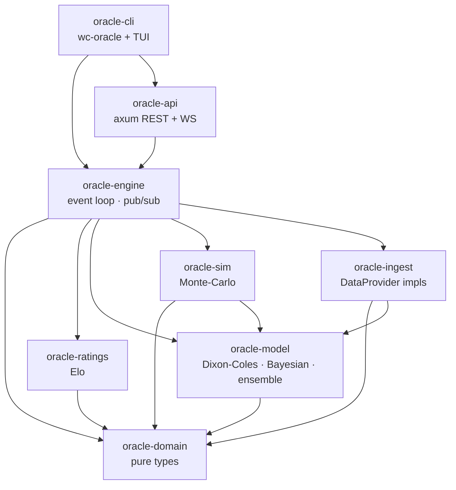
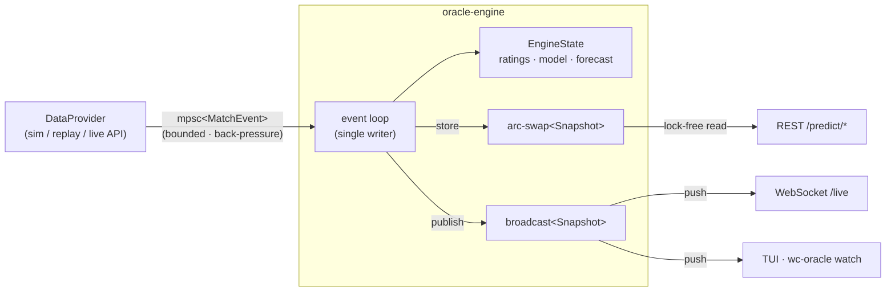

# Architecture

`worldcup-oracle` is a Cargo **workspace** of eight focused crates. Dependencies flow
strictly downhill from a zero-I/O domain core, so the prediction math, the data
sources, and the transport layers can each change without disturbing the others.

## Crate graph



`oracle-domain` depends on nothing but `serde`/`chrono`. Everything points *at* it;
it points at nothing. That inversion is what keeps the core stable.

## Runtime data flow (live, event-driven)



A **single task** owns all mutable state and applies events serially — no locks on
the hot path, no data races. Readers never touch that state: they either load the
lock-free `arc-swap` cell (REST) or subscribe to the broadcast channel (push).
Expensive Monte-Carlo forecasts are recomputed on a throttle and whenever a result
lands, not on every clock tick.

## The model

### Elo (`oracle-ratings`)
Expected score with optional home edge and logistic scale `s = 400`:

```
E_home = 1 / (1 + 10^(-((R_home + H) - R_away) / s))
```

Updates are zero-sum and scaled by the **World Football Elo** goal-difference index
`G` (1.0 for a one-goal win, 1.5 for two, then `(11+d)/8`):

```
ΔR = K · G · (W_actual - E_home)
```

The three-way split models the draw mass as a Gaussian in the rating gap,
`P(draw) = p_peak · exp(-(Δ/scale)²)`, then solves for home/away while preserving
`E = P(home) + ½·P(draw)`.

### Dixon-Coles goal model (`oracle-model`)
Each team has attack `α` and defense `β` coefficients. For home `i` vs away `j`:

```
log λ = c + α_i − β_j + h        (home goals)
log μ = c + α_j − β_i            (away goals)
```

The joint score distribution is two near-independent Poissons with the Dixon-Coles
low-score correction `τ` on the {0-0, 1-0, 0-1, 1-1} cells (real football has more
low-scoring draws than independence implies):

```
P(x, y) = τ(x, y; λ, μ, ρ) · Poisson(x; λ) · Poisson(y; μ)
```

Parameters are fit by **maximum likelihood** on historical results, each weighted by
`exp(−ξ · age_days)` so recent form counts more. The attack/defense/intercept/home
terms ascend the time-weighted Poisson log-likelihood analytically (the score
equations reduce to `observed − expected` goals); `ρ` is fit by a 1-D search over the
fully-corrected likelihood.

### Bayesian in-match updating (`oracle-model::live`)
Live, we condition on the current scoreline, minute, and red cards. Remaining goals
for each side are Poisson over the time left, scaled by the fraction of the match
remaining and perturbed by red cards. Convolving "goals already in" with the
posterior over "goals still to come" gives live win/draw/win probabilities that move
on every event.

### Ensemble (`oracle-model::ensemble`)
A **logarithmic opinion pool** (weighted geometric mean) blends the Dixon-Coles and
Elo forecasts: `p(o) ∝ Π_k p_k(o)^{w_k}`. Log-space pooling stays sharp where an
arithmetic average washes out toward uniform.

### Monte-Carlo tournament sim (`oracle-sim`)
Plays the remaining group fixtures and the 32-team knockout out tens of thousands of
times — sampling each scoreline from the goal model — to estimate every team's
probability of advancing, reaching each round, and winning the cup. Iterations are
independent, so it fans out over `rayon`; per-iteration RNG seeds make a given
`(seed, iterations)` perfectly reproducible.

## Quality gates
- Unit + property-style tests in every crate (probabilities normalize, Elo is
  zero-sum, score grids sum to 1, forecasts nest monotonically).
- An integration test (`oracle-ingest/tests/calibration.rs`) fits on a train split
  and asserts the model beats the uniform baseline out-of-sample (Brier + log-loss).
- A Criterion benchmark (`oracle-sim/benches/tournament.rs`) tracks simulation
  throughput.
- CI runs `fmt --check`, `clippy -D warnings`, the test suite, and a release build.
