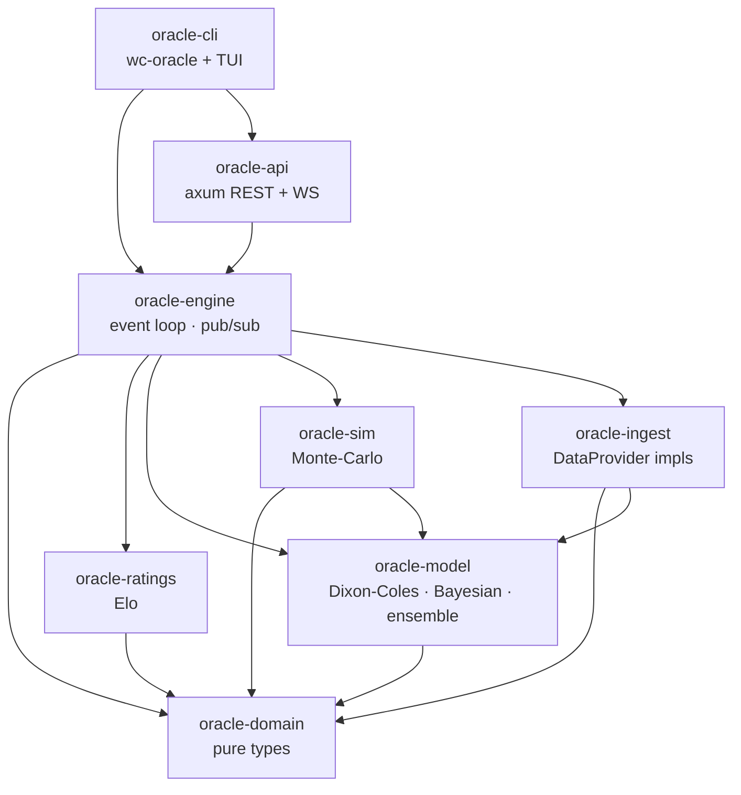
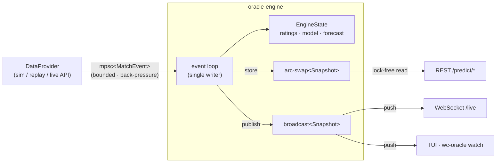

# Architecture

`worldcup-oracle` is a Cargo **workspace** of eight focused crates. Dependencies flow
strictly downhill from a zero-I/O domain core, so the prediction math, the data
sources, and the transport layers can each change without disturbing the others.

## Crate graph



`oracle-domain` depends on nothing but `serde`/`chrono`. Everything points *at* it;
it points at nothing. That inversion is what keeps the core stable.

## Runtime data flow (live, event-driven)



A **single task** owns all mutable state and applies events serially - no locks on
the hot path, no data races. Readers never touch that state: they either load the
lock-free `arc-swap` cell (REST) or subscribe to the broadcast channel (push).
Expensive Monte-Carlo forecasts are recomputed on a throttle and whenever a result
lands, not on every clock tick.

## The model

### Elo (`oracle-ratings`)
Expected score with optional home edge and logistic scale `s = 400`:

```
E_home = 1 / (1 + 10^(-((R_home + H) - R_away) / s))
```

Updates are zero-sum and scaled by the **World Football Elo** goal-difference index
`G` (1.0 for a one-goal win, 1.5 for two, then `(11+d)/8`):

```
ΔR = K · G · (W_actual - E_home)
```

The three-way split models the draw mass as a Gaussian in the rating gap,
`P(draw) = p_peak · exp(-(Δ/scale)²)`, then solves for home/away while preserving
`E = P(home) + ½·P(draw)`.

### Dixon-Coles goal model (`oracle-model`)
Each team has attack `α` and defense `β` coefficients. For home `i` vs away `j`:

```
log λ = c + α_i − β_j + h        (home goals)
log μ = c + α_j − β_i            (away goals)
```

The joint score distribution uses one of two **score models** (`ScoreModel`, selectable and
tunable). Independent (default): two Poissons with the Dixon-Coles low-score correction `τ`
on the {0-0, 1-0, 0-1, 1-1} cells (real football has more low-scoring draws than
independence implies), `P(x, y) = τ(x, y; λ, μ, ρ) · Poisson(x; λ) · Poisson(y; μ)`.
Bivariate Poisson: a shared component `λ3` induces positive correlation directly,
`X = U1 + U3`, `Y = U2 + U3`, with the marginal means preserved (`λ1 = λ − λ3`); `λ3 = 0`
recovers independence.

Parameters are fit by **maximum likelihood** on historical results, each weighted by
`exp(−ξ · age_days)` so recent form counts more. The attack/defense/intercept/home terms are
found by **L-BFGS** (`lbfgs`): the coefficients are packed into one vector and minimized against
the penalized negative log-likelihood, with the last few curvature pairs approximating the
inverse Hessian (two-loop recursion) and a backtracking Armijo line search guaranteeing descent.
It converges in tens of iterations where the previous hand-rolled gradient ascent took hundreds,
and finds a slightly better optimum (the backtest confirms it). The gauge is pinned afterward by
folding the coefficient means into the intercept, which leaves every prediction unchanged. The
dependence parameter (`ρ` or `λ3`) is then fit by a 1-D search over the fully-corrected likelihood.
When **expected goals (xG)** are attached to an observation the fit regresses on them
instead of the realized goals: xG is a much lower-noise signal (a team can dominate xG and
lose), so the same estimating equation gives a sharper model. An **L2 (ridge)** penalty
shrinks the coefficients toward the mean; because a data-rich team accumulates a larger
gradient, sparse-data teams are shrunk more, the regularization a sparse, unbalanced
international schedule needs.

The Independent model's margins are **negative-binomial**, not pure Poisson. Real football
goals are mildly *overdispersed* (the variance exceeds the mean: blowouts and goalless games
both happen more than Poisson predicts), which a fixed-rate Poisson cannot capture. The
negative binomial is the Gamma-Poisson mixture - a team's rate varies match to match - and its
dispersion (the NB "size" `r`; `r → ∞` is Poisson) is **fit from the data** by a 1-D likelihood
search alongside `ρ`, so the score grid gets correctly fatter tails. The Monte-Carlo mirrors
this, sampling each scoreline from the same Gamma-Poisson so the tournament forecast inherits the
overdispersion rather than under-stating extreme results.

The fit is also **hierarchical** (`fit_with_confederations`). A World Cup's core blind spot is
that confederations rarely play each other, so cross-confederation strength is poorly pinned
down and a confederation that mostly plays itself has its level set by only a handful of
inter-confederation matches. Instead of shrinking every team toward the *global* mean (plain
ridge), each team's attack/defense is **partially pooled toward its confederation mean**, so a
data-poor team borrows strength from its confederation rather than being dragged to the world
average; a `1 - POOL` pull toward neutral keeps a sparse confederation's level from drifting. The
confederation level (`confederation_levels`, mean `attack + defense`) thus becomes a regularized,
shared quantity. A *separate* additive per-confederation offset was considered and rejected: it
is collinear with a confederation-wide attack+defense shift in the team coefficients (so it is not
separately identifiable), and a genuinely non-additive pairwise confederation interaction is left
as future work, the inter-confederation data being too sparse for the 2026 draw. With no
confederation map supplied the fit reduces exactly to the plain global-ridge version.

The hand-tuning is removed by `wc-oracle tune`, which runs **Bayesian optimization**
(`oracle-model::bayes_opt`: a Gaussian-process surrogate with Expected-Improvement acquisition)
over the continuous time-decay `ξ` and ridge strength, once per score model, selecting on a
validation split by log-loss and reporting the winner's honest test-set loss. It reaches a better
optimum in fewer fits than a grid - and over continuous values a fixed lattice cannot land on -
so these constants are optimized rather than guessed.

The model also **learns in-tournament**: `update_with_result` applies one online
gradient step (the per-observation step of the fit, residual-clamped, on just the two
teams' coefficients) on each finished match. The engine calls it from the `FullTime` arm
alongside the Elo update, so as the group stage unfolds the forecast tracks tournament form
instead of staying frozen at the offline fit.

The engine also **recalibrates in-tournament**. Where the online update moves the point
estimates, a **temperature-scaling** layer fixes their sharpness: from the `FullTime` arm it
records the match's pre-match forecast (`pre_match_probs`, captured *before* the result updates
the model, so the pair is leak-free) against the realized outcome, and once `MIN_CALIB_SAMPLES`
matches have finished it refits the single temperature that minimizes log-loss over those pairs
(`oracle_model::fit_temperature`) and applies it (`apply_temperature`) to every remaining
scheduled-match forecast. It is the identity until enough results accumulate, so early forecasts
are untouched.

### State-space (Kalman) rating (`oracle-ratings::state_space`)
The deeper version of in-tournament learning *and* uncertainty. Each team carries a Gaussian
belief about its latent strength, `N(mean, var)`, in goal-difference units. Between matches the
strength performs a **random walk** (variance grows with elapsed days, so a thinly-observed team
is correctly less certain); at a match the goal margin is a noisy linear measurement of the
strength gap and a two-state **Kalman update** moves both means toward the surprise and shrinks
their variances. It is trained offline over the full match history and then updated live from each
`FullTime`.

Live, results arrive through `observe_tournament` rather than the day-based `observe`: tournament
matches are only days apart, so the elapsed-time walk barely moves the filter and it would grow
overconfident and sluggish across the competition. Instead a fixed **per-match process-noise bump**
(`tournament_process_var`) is injected before each Kalman update, keeping the gain up so recent
results move the estimate faster and the per-team uncertainty does not collapse mid-tournament.

It produces two things a point-estimate rating cannot: a win/draw/win prediction that
becomes the ensemble's fourth member, and a per-team *uncertainty* (`stddev`) that the engine maps
to log-rate units and feeds the Monte-Carlo as a dynamic `rating_sigma` (below), replacing the
static fit-based uncertainty. A single latent strength is modelled, not separate attack/defense
states.

### Bayesian in-match updating (`oracle-model::live`)
Live, we condition on the current scoreline, minute, and red cards. Remaining goals
for each side are Poisson over the time left, scaled by the fraction of the match
remaining and perturbed by red cards. **Score effects** then adjust the remaining-goal
intensities by the current margin (saturating with `tanh(|margin|)`): a trailing team
chases (scores more) and a leading team defends (scores less), the well-documented
within-match dynamic. Convolving "goals already in" with the posterior over "goals still
to come" gives live win/draw/win probabilities that move on every event.

### Ensemble (`oracle-model::ensemble`)
A temperature-scaled **logarithmic opinion pool** blends up to four members,
`[Dixon-Coles, Elo, State-space, Market]`: `q(o) ∝ exp(τ · Σ_k a_k · ln p_k(o))`. The mixture
weights `a_k` and temperature `τ` are **learned by stacking** (gradient descent on held-out log
loss in `Ensemble::fit`), so the blend is provably no worse than its best member. The offline
baseline learns them by **out-of-fold stacking** (`data::fit_baseline`): with K interleaved folds
each member is fit on the other folds and predicts the held-out fold, so the weights are trained
on leakage-free predictions spanning the whole dataset rather than a single held-out tail, and the
members are then refit on all the data for deployment. When a match has bookmaker odds they enter
as the fourth member and the ensemble anchors to them; with no odds it degrades cleanly to the
three model members (`blend` renormalizes the weights).

### Lineup, suspension & venue adjustments (`oracle-ingest::data` + `oracle-model`)
Three context signals produce log-space per-team `(attack, defense)` deltas that sum and
feed `GoalModel::expected_goals_adjusted`. **Lineups**: a confirmed XI compared to the
strongest available XI (a missing key player lowers that side and lifts the opponent).
**Suspensions**: the engine accumulates `YellowCard` events per player and, on reaching the
threshold (2), drops that player from the team's next unplayed match. That match's prediction
and forecast then carry the lineup penalty as a *pre-lineup prior*, superseded by the real
lineup once it is announced (which on a live feed already excludes the suspended player).
**Venue/crowd/travel/heat (`MatchContext`)**: host-nation familiarity, Mexico-City-style altitude,
rest-day differential, plus three signals specific to a continent-spanning North American summer:
- **Crowd composition** - a continuous `crowd_support` in [-1, 1] derived from each side's
  expected support in the venue's city (a literal host on home soil packs the stadium; Mexico
  draws a near-home crowd across US venues; otherwise a confederation-level diaspora /
  traveling-fan pull). This captures partisanship in nominally neutral games that the binary
  host flag misses, and lifts the favored side while denting the other.
- **Travel & circadian load** - distance (haversine between consecutive venues) and the
  signed time-zone shift since a side's last match sap its attack, with **eastward** travel (a
  phase advance) weighted harder than westward. The differential between the two sides is what
  tilts the match, so a team camped in one region is fresher than one criss-crossing the map.
- **Heat** - the venue's summer high and the local kickoff hour give a match temperature; above a
  comfort threshold it suppresses tempo for *both* sides. Scaling both goal rates down by the same
  factor also *flattens the favourite's edge*: fewer goals make the scoreline noisier, so the
  underdog's chance rises. That leveling falls out of the Poisson variance for free.

All of these (and any pre-lineup suspension penalty) apply to every Monte-Carlo fixture, so they
reach the champion odds. Squads, xG, venue assignments, the crowd-pull model, and heat are
synthetic offline; rest days, travel, and time-zone shifts come from the real fixture schedule
and venue coordinates.

Live, the engine carries an **aggregate context gain** (`context_gain`) that scales this whole
context adjustment, recalibrated in-tournament: at each `FullTime` it records the context's
contribution to the predicted margin against the residual it should explain, and once
`CONTEXT_CALIB_MIN` matches have finished it refits the gain with `fit_gain_toward_one` (a 1-D ridge
shrunk hard toward 1, then clamped). So if the context effects are playing out stronger or weaker
than the reasoned priors, the remaining forecasts follow. It is deliberately *one* gain, not
per-signal: a single tournament cannot reliably separate the correlated host/crowd/heat/travel
effects, so context is stored separately from style (only context is scaled) and the honest
statistic is their combined strength. The gain stays at 1 until enough results accumulate.

### Style matchups (`oracle-model::style` + `oracle-ingest::data`)
Every other strength signal is *additive* (a team's rating minus its opponent's), which cannot
represent matchups that defy ratings - a low block frustrating a possession side, a high press
rattling a slow builder. Each team gets a low-dimensional **style embedding** and a matchup is
scored by a **bilinear** form `sₕᵀ M sₐ`. With an antisymmetric `M` the interaction is
**non-transitive** - a rock-paper-scissors cycle (style A troubles B, B troubles C, C troubles A) -
which is exactly what additive ratings miss. Here the embeddings are unit vectors (a style angle),
so the form reduces to `K·sin(θₐ − θₕ)`: orthogonal styles give the maximum tilt, identical styles
none, and swapping the teams flips the sign. The scalar tilts the goal difference and rides the
same per-match adjustment path as venue/lineup (`data::matchup_adjustments` sums venue and style).
The embeddings are reasoned-synthetic offline (regional style clusters with per-team jitter); on
real data they would be fit from match residuals - a low-rank factorization of the part of the
result that strength alone does not explain.

### Market prior & benchmark (`oracle-model::implied_probabilities`)
Decimal odds are inverted and the overround normalized away to recover the bookmaker's
implied probabilities. These feed the ensemble's third member (above) and, in `backtest`,
score the market on the held-out split beside the models, so "can we beat the book" is
explicit. `load_results_csv` ingests real football-data.co.uk results with closing odds
(and optional xG columns).

### Monte-Carlo tournament sim (`oracle-sim`)
Plays the remaining group fixtures and the 32-team knockout out tens of thousands of
times - sampling each scoreline from the goal model - to estimate every team's
probability of advancing, reaching each round, and winning the cup. A level knockout tie
goes to **30 minutes of extra time** at a reduced rate and, if still level, a **penalty
shootout** that is close to a coin flip (tilted by the expected-goal edge and per-team
**shootout skill**, clamped to [0.35, 0.65]), instead of being decided by relative strength.
The knockout rounds also carry a per-team **knockout pedigree** - a log-rate tilt applied only to
knockout ties (single-elimination temperament/experience), an effect open-play strength, which
acts in every match, structurally cannot represent (both knockout factors are reasoned-synthetic
offline - real: historical shootout conversion and knockout history - and feed in via
`LiveInputs`). And because the bracket is played round by round, a side whose tie goes to **extra
time** carries a one-round **fatigue** penalty into the next round - a genuinely dynamic
within-tournament state the per-tie sampling tracks. Iterations are independent, so it fans out
over `rayon`; per-iteration RNG seeds make
a given `(seed, iterations)` perfectly reproducible. Each probability carries a Monte-Carlo
standard error `sqrt(p(1-p)/N)`, surfaced by `simulate`.

The knockout uses the **fixed 2026 bracket** (`oracle_domain::bracket::FIXED_R32`, shared with
the ingest layer) when the tournament has the real shape - 12 groups of four, top two plus the
eight best thirds - placing each group winner, runner-up, and best third in its slot and playing
a stable R32 -> R16 -> QF -> SF -> Final tree, so a strong group winner is correctly kept away
from other winners until late. Other shapes (small test tournaments) fall back to generic
reflection seeding. The best-third -> slot assignment is a fixed deterministic rule, not FIFA's
full 495-row lookup table, and the team-to-group draw is synthetic.

Once the group stage is complete the **real bracket is materialized** (`data::materialize_knockout`
fills the slots with the actual qualifiers; the engine appends the Round-of-32 fixtures when the
last group result lands). From then on the simulator plays those fixtures rather than re-deriving
a bracket each iteration: a **finished** knockout result stays fixed, an **in-progress** knockout
match is conditioned on its live score exactly as a group match is, and a **scheduled** one is
sampled. So a live upset in the Round of 16 immediately reshapes the champion odds. A finished
knockout level on the scoreline (a penalty decision the event model does not record) is resolved
to the home side - a small documented limitation.

Crucially, each iteration also **resamples every team's strength** from its uncertainty, so the
forecast carries **parameter uncertainty**, not just match variance. The per-team log-rate SD is
the goal model's **Laplace (Fisher-information) posterior** (`strength_uncertainty`): treating the
ridge penalty as a Gaussian prior, the posterior precision is `prior + Fisher information`, so the
SD is `1 / sqrt(ridge + Σ wᵢ·rateᵢ)` - principled, and tighter for a well-observed team than for a
thinly-observed one. The engine can override this with the dynamic state-space rating's SD
(`LiveInputs::rating_sigma`). Data-poor teams wobble more, which fattens the tails and stops
champion odds from being over-concentrated, the failure mode of treating point-estimate ratings as
certain. The `SimConfig::rating_uncertainty` multiplier scales (or disables, at 0) the effect. The
Laplace approximation is a Gaussian posterior around the MAP - the fast treatment used in the hot
path.

### Full posterior by HMC (`oracle-model::hmc`)
Beyond the Gaussian Laplace approximation, `GoalModel::posterior_outcome_samples` draws the **full
posterior** of a matchup's win/draw/win probabilities by **Hamiltonian Monte Carlo**. HMC augments
the parameters with a momentum, rolls the pair forward with the leapfrog integrator using the
log-posterior gradient (the negative of the exact penalized-NLL gradient the L-BFGS fit already
computes), and Metropolis-corrects for the integrator's discretization error - so it follows the
geometry instead of random-walking. A **diagonal mass matrix set to the Laplace variances**
preconditions the dynamics (the very different scales of team vs intercept parameters become
roughly isotropic, so one step size mixes well), the chain starts at the MAP, and the trajectory
length is jittered to avoid harmonic resonances. `wc-oracle predict --posterior` surfaces it as a
**90% credible interval** on each outcome - the model's uncertainty about its own forecast. It runs
offline (CLI), off the live hot path.

### Calibration (`oracle-model::reliability`)
Beyond Brier and log loss, `reliability` bins predictions by confidence and compares
predicted vs empirical frequency, with an expected calibration error (ECE). `backtest`
prints this so the ensemble's calibration is explicit, not assumed.

### Cross-validation & uncertainty (`oracle-model::bootstrap_score_ci`)
A single train/test split is one noisy draw, so `backtest --cv N` runs **rolling-origin
(expanding-window) cross-validation**: the first half of the chronologically ordered matches is
always training, the rest is split into `N` consecutive future blocks, and each fold refits the
goal model, Elo, and the ensemble on everything *before* its block (so there is never any
look-ahead) and predicts the block. The out-of-fold predictions are pooled and each model's Brier
and log-loss are reported with a **bootstrap 95% confidence interval** - resampling driven by a
seeded SplitMix64 generator, so the intervals are reproducible with no `rand` dependency.
Non-overlapping intervals are the honest test of whether a change is a real improvement or within
noise; it is also the instrument that makes future model overhauls measurable rather than
eyeballed.

### Durable event store (`oracle-engine::event_log`)
With `EngineConfig.event_log` set, every consumed event is appended as one JSON line and
the log is replayed on startup to rebuild state, so a restart mid-tournament recovers
rather than starting cold. The earlier `ScoreSync`/`FullTime` reconciliation makes resume
self-healing for a live feed that re-emits on restart.

### On-demand explorer (`oracle-engine::query` + `oracle-api` + `static/explore.html`)
The live `Engine` tracks one running tournament; the `Explorer` is its complement - a fit-once,
read-only view that answers *ad-hoc* questions (predict any matchup, its HMC posterior credible
interval, a custom Monte-Carlo run, the signal-sensitivity ablation, the ratings). It holds its own
baseline (`data::fit_baseline`)
so exploration never perturbs the live state, and it reuses the model paths the CLI uses
(`GoalModel::{score_grid, posterior_outcome_samples, confederation_levels}`, `Ensemble::blend`,
`simulate_with_live`). The transport stays a thin shell: `oracle-api` carries both the `Engine` and
the `Explorer` in its state (split via `FromRef`), and the new `/api/*` handlers just forward an
`Explorer` result as JSON - the compute-heavy ones (HMC posterior, simulation, the ten-run
sensitivity ablation) on `spawn_blocking` so they never stall the async runtime. The ablation logic
itself lives once in `oracle_engine::signal_sensitivity`, shared by the CLI `sensitivity` command
and the explorer. `/explore` serves a dependency-free vanilla-JS page (no build step) with those
queries plus an exact-score-grid heatmap, a credible-interval view, and a sensitivity bar chart.
Request inputs (`iters`, `samples`) are clamped.

## Quality gates
- Unit + property-style tests in every crate (probabilities normalize, Elo is
  zero-sum, score grids sum to 1, forecasts nest monotonically).
- An integration test (`oracle-ingest/tests/calibration.rs`) fits on a train split
  and asserts the model beats the uniform baseline out-of-sample (Brier + log-loss).
- A Criterion benchmark (`oracle-sim/benches/tournament.rs`) tracks simulation
  throughput.
- CI runs `fmt --check`, `clippy -D warnings`, the test suite, and a release build.
